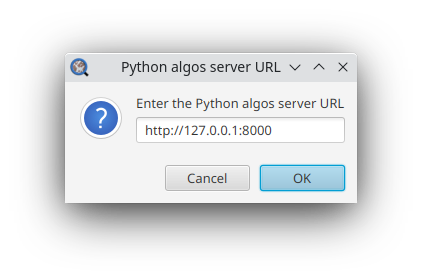
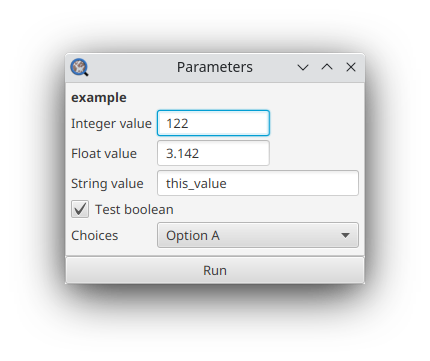

# QuPath extension PyAlgos

This is a QuPath extension to run Python-based image processing algorithms, in combination with the Python
API [api-py-algos](https://github.com/EPFL-Center-for-Imaging/api-py-algos).
The algorithms are fully defined in the Python API; this extension provides a user interface to process images using
Python algorithms within the QuPath software.

The algorithms rely on the following **inputs**:

- An image region selected by an annotation on a 2D image.
  For single-channel or RGB images, all the pixels selected will be sent. For multi-channel images,
  only the channel currently selected is sent, and if multiple channels are selected, then an RGB-rendering of the
  selected channels is sent.
- The values of required parameters, defined in the Python API and set through the QuPath user interface.

The **output** is a set of objects displayed on the input image, with their associated measurements and classification.

### Installation

1. Drag and drop the latest extension jar file **qupath-extension-pyalgos-[version].jar** from [Releases](https://github.com/EPFL-Center-for-Imaging/qupath-extension-pyalgos/releases).
   into the main QuPath window, then restart QuPath. The extension is compatible with QuPath version **0.5.0** and above.

2. Setup and launch the [PyAlgos server](https://github.com/EPFL-Center-for-Imaging/api-py-algos).

### Update

To avoid conflict with the previous version, first delete the older extension jar file in the QuPath's extension
directory,
then follow the installation steps for the new version.

### Build

This is a Gradle project, build it using the Gradle command: `./gradlew clean build` (for Linux and MacOS)
or `./gradlew clean build` for Windows.
The build is then found here: **build/libs/qupath-extension-pyalgos-[version].jar**

### Usage

The PyAlgos extension is available under the **Extensions>Python algos** menu.

1. Connect to the server by clicking on **Extensions>Python algos>Connect...** and entering the Python algos server URL.
   The Python server from [api-py-algos](https://github.com/EPFL-Center-for-Imaging/api-py-algos) must be up and
   running on the corresponding URL. Once successfully connected to the server, the available algorithms are populated
   in the sub-menus of **Python algos**.

   
2. Create an annotation on an image. For single-channel or RGB images, all the pixels selected will be sent. For
   multi-channel fluorescence images,
   only the channel currently selected is sent, and if multiple channels are selected, then an RGB-rendering of the
   selected channels is sent.
3. Select one of the available algorithm from the **PyAlgos** menu. If there are parameters required for the selected
   algorithm, as defined on the Python API,
   a window to set those parameters will be displayed.
   If the algorithm has no tunable parameters, it will be run directly.

4. Once the processing is completed successfully, the resulting objects (typically detected cells) are displayed in
   QuPath.
   The objects contain their associated measurements (e.g. the detection probability) and classification.
   On the Python API, the objects correspond to geojson features, defined by their geometry
   (e.g. the coordinates of the contour of the object) and properties.
